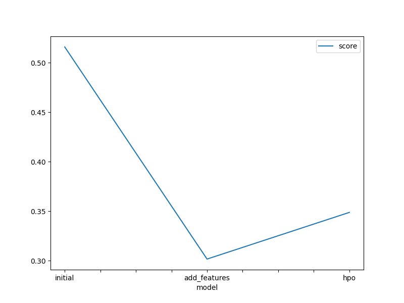
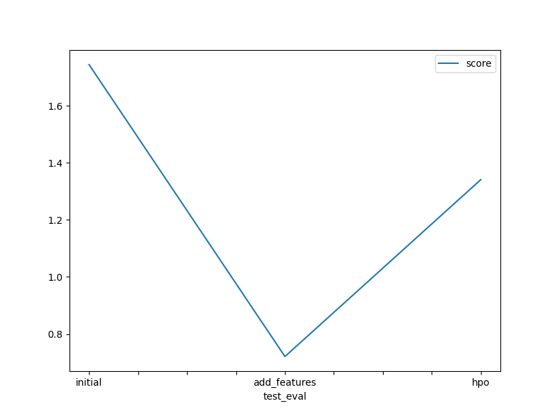

# Report: Predict Bike Sharing Demand with AutoGluon Solution
#### Hossein Davoodi

## Initial Training
### What did you realize when you tried to submit your predictions? What changes were needed to the output of the predictor to submit your results?
I realized that kaggle won't accept my prediction results if the values are negative. so i had to detect negative values in my predictions and set them to 0.

### What was the top ranked model that performed?
**WeightedEnsemble_L2** is the top ranked model for **predictor_new_hpo**
**WeightedEnsemble_L3** is the top ranked model for **predictor_new_features**
**WeightedEnsemble_L3** is the top ranked model for **predictor**

## Exploratory data analysis and feature creation
### What did the exploratory analysis find and how did you add additional features?
exploratory analysis aims to uncover patterns, relationships, and insights within a dataset. When applied to a model, explanatory analysis helps to understand various aspects of the model's performance, behavior, and underlying data. the added feature **hour** has been extracted from the datetime
and added to the data.
    # creating a new feature
    train["hour"] = train["datetime"].dt.hour
    test["hour"] = test["datetime"].dt.hour 

### How much better did your model preform after adding additional features and why do you think that is?
first model Kaggle score: 1.74807

model with new features Kaggle score: 0.68239

so after adding new features the model performed 60,96% better.

## Hyper parameter tuning
### How much better did your model preform after trying different hyper parameters?
first model Kaggle score: 1.74807

model with new features Kaggle score: 0.68239

model with new features and hyper parameters Kaggle score:  0.54605

Model performance imporved by 19.97% after trying different **hyperparameters** compared to just adding **new features**

Model with different **hyperparameters** performed 68.76% better than the first model without added **new features**

### If you were given more time with this dataset, where do you think you would spend more time?
first of all, i would have added more additional features and afterwards , i would have tried to manipulate Hyper parameters to find the best performance

### Create a table with the models you ran, the hyperparameters modified, and the kaggle score.
|model|hpo1|hpo2|hpo3|score|
|--|--|--|--|--|
|initial|0.05|300|97|1.74807|
|add_features|0.05|300|96|0.68239|
|hpo|0.05|1000|100|0.54605|

### Create a line plot showing the top model score for the three (or more) training runs during the project.

### Create a line plot showing the top kaggle score for the three (or more) prediction submissions during the project.

## Summary
the model i was given, i first tarined and did a prediction of then , i have added the additional features and trained it, and afterwards by tuning hyperparameters i could get a relatively better performance at the end.